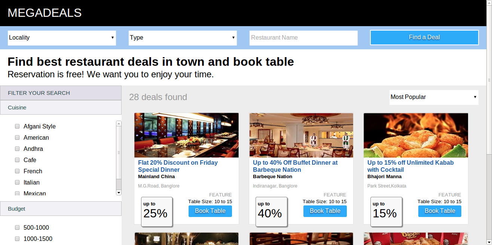
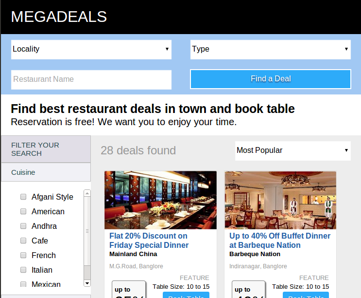
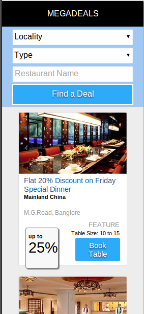

#ResponsiveWeb using SASS, Singularitygs and Breakpoint
========================================

####A small proof of concept of responsive cross-browser compatible web design.

#### the layout for all resolution greater than 760px wide screen.

========================================

####layout for all resolution lesser than 760px wide screen.

========================================
####layout for all images lesser than 320 px

####[DEMO LINK](http://responsivepoc.co.nf/)